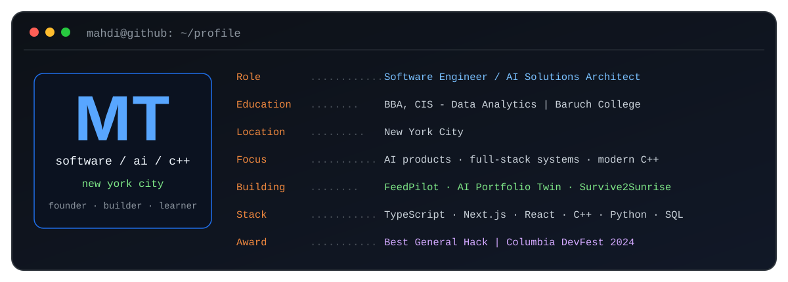

  

  
  
  
  

## About

I am a New York-based software engineer and the founder of [LIC Web Solutions](https://www.licwebsolutions.com/). I build production web applications and AI product workflows. I also write modern C++ software.

I earned a **BBA in Computer Information Systems, Data Analytics** from **Baruch College**. My recent work covers streamed LLM interfaces, agentic chat systems, and RSS ingestion. I have also built access-controlled SaaS dashboards, headless CMS architecture, and cross-platform terminal games.

## Selected engineering work

### [FeedPilot](https://github.com/MahdiT54/AI-Newsletter)

Full-stack AI newsletter SaaS. It ingests RSS feeds, validates sources, and refreshes stale feeds. Articles are deduplicated by GUID before structured newsletter output is streamed to the client. The product includes Clerk authentication, plan-gated access, reusable settings, and persisted generation history.

**Stack:** Next.js 16, React 19, TypeScript, Tailwind CSS, Vercel AI SDK, OpenAI, Clerk, Prisma, MongoDB

---

### [AI Portfolio Twin](https://www.mahditanzim.me/)

Agentic portfolio assistant built with OpenAI ChatKit and the Agents SDK. It retrieves live portfolio context from Sanity. The workflow filters unsupported topics, applies moderation and guardrails, persists threads in Upstash Redis, and rate-limits guest traffic.

**Stack:** Next.js, TypeScript, OpenAI ChatKit, OpenAI Agents SDK, Sanity, GROQ, Upstash Redis

[View the repository](https://github.com/MahdiT54/mahdi-eportfolio-2026)

---

### [Survive2Sunrise](https://github.com/MahdiT54/fnaf-cpp)

Cross-platform C++17 terminal survival game built with ncurses. The codebase separates shared game state, enemy AI, input handling, and terminal rendering into focused modules. CMake builds and packaged releases support Windows and macOS.

**Stack:** C++17, ncurses, CMake, modular game architecture

[Download a release](https://github.com/MahdiT54/fnaf-cpp/releases)

---

### [Your Congress](https://devpost.com/software/your-congress)

Winner of **Best General Hack at Columbia DevFest 2024**. The civic-tech application combines a React interface, Flask services, policy APIs, and semantic analysis to help users explore legislation and connect policies with representatives. I worked on the front end and OpenAI-powered bill matching.

**Stack:** React, JavaScript, Python, Flask, OpenAI, semantic search

[View the team repository](https://github.com/ibrakhimus/columbia-hackathon)

## Engineering toolkit

| Area | Technologies |
|---|---|
| **Product engineering** | TypeScript, JavaScript, React, Next.js, Node.js, Tailwind CSS |
| **AI and data** | OpenAI API, Vercel AI SDK, ChromaDB, Sanity, MongoDB, Firebase, SQL |
| **Systems** | C++, C, ncurses, CMake |
| **Delivery** | Git, GitHub Actions, Vercel, Clerk, Prisma, Stripe |

## Current direction

I am focused on shipping FeedPilot, extending my agentic AI portfolio system, and deepening my C++ knowledge through game architecture and reverse-engineering work.

I am open to **software engineering and forward deployed engineering roles**. I am also interested in platform and AI application work.

## GitHub activity

<picture>
  <source
    media="(prefers-color-scheme: dark)"
    srcset="https://github-readme-stats.vercel.app/api?username=MahdiT54&show_icons=true&include_all_commits=true&hide_border=true&rank_icon=github&theme=github_dark"
  />
  <source
    media="(prefers-color-scheme: light)"
    srcset="https://github-readme-stats.vercel.app/api?username=MahdiT54&show_icons=true&include_all_commits=true&hide_border=true&rank_icon=github&theme=default"
  />
  
</picture>

---

  <strong>Build useful systems. Ship them. Improve the architecture.</strong>

